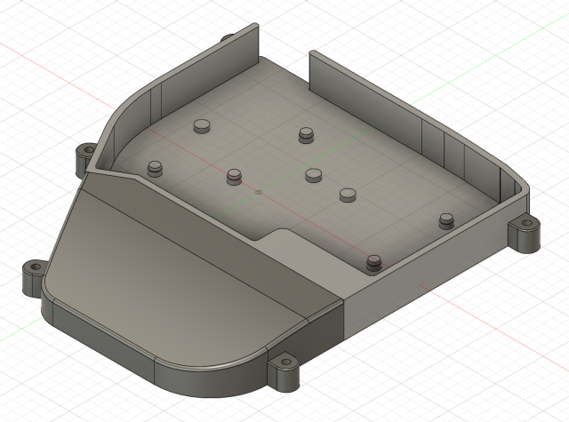

# Karl's Lily58 Keyboard Case

This repository contains the source files for my own 3D printed case for the
[Lily58 Pro](https://github.com/kata0510/Lily58) keyboard. It is based on the
"Lily58 Case With Wrist Rest" by user Willianr on Thingiverse
([link to original](https://www.thingiverse.com/thing:4706649)).

## Features

### Full Keyboard Case

This model is a full surround case for the Lily58 Pro. Unlike some other
models, this case can be easily retrofitted to a built Lily58 Pro (you only
need to remove the backing plate and brass standoffs).

### In-Built Palm Rest

The case has a built in palm rest to allow you to type while minimizing arm
strain.

### Inset Backplates to Reduce Wrist Flexing

Unlike the default lily58 acrylic/metal case, and other third party Lily58
cases, this case features inset backplates to try to keep your wrist and forarm
as straight as possible, and minimize travel while typing.

### Optional Tenting Support

Add some M3 bolts and nuts, and you can have full tenting support, customized
to best suit your typing posture! The image above shows a slight outward
tenting angle as well as a negative slope (keys lower at the top than the
bottom) which is my ideal position.

## Store Pages

If you simply wish to import the case into your 3D printing software, try the
Thingiverse page instead, which provides the STL files for use:

* Karl's Lily58 Keyboard Case @ Thingiverse: <https://www.thingiverse.com/thing:5422861>

## Usage

The files in this package are STEP 3D model files. **These cannot be used**
**with your 3D printer on their own**. You must export them using 3D modelling
software like
[Autodesk Fusion 360](https://www.autodesk.co.uk/products/fusion-360/) (free
for personal use) or a product such as FreeCAD.

Rough step-by-step instructions follow, you may need to adjust to your software
setup:

1. Open your 3D software.
2. Use the import feature to open the STEP file.
3. Use the export feature to save as STL.

Once you have converted the files to STL format, you can open them in your
3D printing software (e.g.
[Ultimaker Cura](https://ultimaker.com/software/ultimaker-cura)) to create the
instructions for your specific 3D printer.

There are two files you can use to create your own cases. `left.step` and
`right.step` are perfect mirror images. You do not need to edit both, rather it
is faster to make changes on one half, then simply use a mirror tool in your
3D software to create the opposite side's file.

I provide both files here only for your convenience.

## License

These files are licensed under the Creative Commons Attribution-NonCommercial
4.0 International agreement:

**You are free to:**

* Share — copy and redistribute the material in any medium or format
* Adapt — remix, transform, and build upon the material

The licensor cannot revoke these freedoms as long as you follow the license
terms.

**Under the following terms:**

* Attribution — You must give appropriate credit, provide a link to the
  license, and indicate if changes were made. You may do so in any reasonable
  manner, but not in any way that suggests the licensor endorses you or your
  use.
* NonCommercial — You may not use the material for commercial purposes.
* No additional restrictions — You may not apply legal terms or technological
  measures that legally restrict others from doing anything the license permits.

For full text, refer to [LICENSE](LICENSE)
